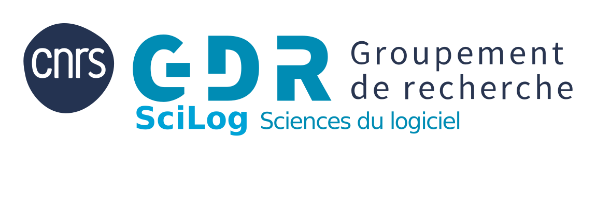

= GDR SciLog - Site Web
:url: https://gdr-scilog.cnrs.fr/
:repo: https://src.koda.cnrs.fr/gdr-scilog/private/site.git/
:scilog: https://gdr-scilog.cnrs.fr/[GDR SciLog]
:ins2i: http://www.cnrs.fr/ins2i/[CNRS Sciences Informatiques]

ifdef::env-github[]
:tip-caption: :bulb:
:note-caption: :information_source:
:important-caption: :heavy_exclamation_mark:
:caution-caption: :fire:
:warning-caption: :warning:
endif::[]

Ce dépôt contient les sources du site {url}.

Le site est construit avec https://gohugo.io/[Hugo], un générateur de site statique. Pour contribuer, il suffit le plus souvent de modifier ou d'ajouter des fichiers Markdown dans le dossier `content/`, puis d'ouvrir une Pull Request.

== Pour aller vite

Vous voulez simplement modifier une page ou ajouter une actualité ?

[source,bash]
----
git clone --recurse-submodules {repo}
cd site
hugo server -D
----

Ouvrez ensuite http://localhost:1313 dans votre navigateur.

Si `hugo` n'est pas reconnu, installez-le d'abord :

[source,bash]
----
# macOS
brew install hugo

# Debian / Ubuntu
sudo apt install hugo
----

TIP: Le site est prévisualisé localement. Rien n'est publié tant qu'une Pull Request n'est pas validée et fusionnée.

== De quoi ai-je besoin ?

Avant de contribuer, installez :

* *Git* pour récupérer le dépôt et envoyer vos modifications.
* *Hugo Extended* pour lancer le site sur votre machine.
* Un éditeur de texte, par exemple VS Code, Emacs, Vim ou autre.

Le site utilise actuellement :

* *Hugo* pour générer le site.
* *Markdown* et parfois *AsciiDoc* pour écrire le contenu.
* *GitHub Actions* pour construire et déployer automatiquement le site après validation.
* Un thème Hugo personnalisé situé dans `themes/mon-theme`.

== Comprendre le dépôt

Les dossiers les plus importants sont :

`content/`::
  Pages, actualités, groupes, défis, actions et contenus visibles sur le site. C'est le dossier que vous modifierez le plus souvent.

`static/assets/`::
  Images, PDF et autres fichiers servis tels quels par le site.

`archetypes/`::
  Modèles utilisés par Hugo quand vous créez un nouveau contenu avec `hugo new`.

`layouts/` et `themes/mon-theme/`::
  Mise en page et thème du site. A modifier seulement si vous touchez au design ou au comportement du site.

`docs/`::
  Documentation technique générée ou complémentaire.

`hugo.toml`::
  Configuration principale du site.

== Contribuer pas à pas

=== 1. Récupérer le dépôt

[source,bash]
----
git clone --recurse-submodules {repo}
cd site
----

Si vous avez un problème d'authentification, utilisez l'URL avec votre identifiant :

[source,bash]
----
git clone --recurse-submodules https://votre.login@src.koda.cnrs.fr/gdr-scilog/private/site.git
----

=== 2. Créer une branche

Ne travaillez pas directement sur `main`. Créez une branche courte et explicite :

[source,bash]
----
git checkout -b feature/ajout-actualite-journee-2026
----

Préfixes recommandés :

* `feature/` pour un nouveau contenu.
* `fix/` pour une correction.
* `update/` pour une mise à jour de contenu existant.
* `docs/` pour une modification de documentation.

=== 3. Lancer le site en local

[source,bash]
----
hugo server -D
----

Puis ouvrez http://localhost:1313.

L'option `-D` affiche aussi les contenus marqués `draft = true`. Elle est utile pendant la rédaction.

=== 4. Trouver le bon endroit à modifier

Choisissez le dossier selon le type de contribution :

* Actualité générale : `content/uncategorized/`
* Groupe de travail : `content/group/`
* Défi : `content/defi/`
* Action du GDR : `content/action/`
* Ecole : `content/ecole/`
* Pages de présentation du site : `content/bienvenue-site-scilog/`

Pour modifier une page existante, cherchez son titre dans `content/`, modifiez le fichier `.md`, puis regardez le résultat dans le navigateur.

=== 5. Ajouter une nouvelle actualité

Exemple avec Hugo :

[source,bash]
----
hugo new content content/uncategorized/mon-actualite.md
----

Ouvrez ensuite `content/uncategorized/mon-actualite.md` et complétez le contenu.

Exemple minimal :

[source,markdown]
----
+++
title = "Titre de mon actualite"
date = "2026-01-15T10:00:00+01:00"
draft = false
categories = ["news"]
+++

Texte de l'actualite.

Vous pouvez ajouter des liens, des listes, des images et des titres.
----

IMPORTANT: Passez `draft = false` quand le contenu est prêt à être publié. Un contenu en brouillon peut être visible en local avec `hugo server -D`, mais il ne sera pas publié normalement.

=== 6. Ajouter une image ou un PDF

Placez le fichier dans le dossier adapté :

* Images : `static/assets/png/` ou `static/assets/jpg/`
* PDF : `static/assets/pdf/`

Puis référencez-le dans le contenu Markdown :

[source,markdown]
----

[Télécharger le PDF](/assets/pdf/mon-document.pdf)
----

Utilisez des noms de fichiers simples :

* minuscules
* sans espace
* avec des tirets, par exemple `programme-journee-2026.pdf`

=== 7. Vérifier avant d'envoyer

Avant de créer la Pull Request, vérifiez que le site se construit :

[source,bash]
----
hugo
----

Puis vérifiez les fichiers modifiés :

[source,bash]
----
git status
git diff
----

Relisez rapidement :

* Le titre de la page.
* La date.
* Les liens.
* Les images ou PDF.
* L'orthographe.
* Le rendu dans le navigateur.

=== 8. Commiter

[source,bash]
----
git add content/uncategorized/mon-actualite.md
git commit -m "feat(news): ajout actualite journee 2026"
----

Format recommandé :

`type(scope): description courte`

Types fréquents :

* `feat` : nouveau contenu.
* `fix` : correction.
* `docs` : documentation.
* `style` : mise en forme sans changement de contenu.
* `refactor` : restructuration.
* `chore` : maintenance.

=== 9. Pousser la branche

[source,bash]
----
git push origin feature/ajout-actualite-journee-2026
----

Créez ensuite une Pull Request depuis l'interface GitHub/GitLab du dépôt.

== Checklist Pull Request

Avant de demander une revue, assurez-vous que :

* Le site démarre avec `hugo server -D`.
* Le site se construit avec `hugo`.
* La page modifiée s'affiche correctement.
* Les liens ajoutés fonctionnent.
* Les images et PDF s'ouvrent correctement.
* Les nouveaux fichiers ont des noms clairs, sans espaces.
* Le commit explique clairement la modification.
* Le check GitHub Actions de la Pull Request passe.

== Publication

La publication est automatique :

. Vous ouvrez une Pull Request.
. GitHub Actions vérifie automatiquement que le site se construit.
. L'équipe relit et valide.
. La Pull Request est fusionnée dans `main`.
. GitHub Actions reconstruit le site pour publication.
. Le site {url} est mis à jour après quelques minutes.

Vous n'avez donc pas besoin de déployer le site manuellement pour une contribution classique.

== Commandes utiles

[source,bash]
----
# Lancer le site localement avec les brouillons
hugo server -D

# Construire le site comme en production
hugo

# Voir les fichiers modifiés
git status

# Voir le détail des modifications
git diff
----

== Aide rapide

Si vous ne savez pas où mettre votre modification, ouvrez une Pull Request avec ce que vous avez fait et expliquez votre intention. L'équipe pourra vous aider à placer le contenu au bon endroit.

== Comment fonctionne le CI/CD ?

Le CI/CD est la partie automatique qui construit puis publie le site. Sa configuration se trouve dans `.github/workflows/hugo.yaml`.

Dans ce dépôt, le workflow se lance :

* à chaque ouverture ou mise à jour d'une Pull Request vers `main` ;
* quand une modification arrive sur la branche `main`, par exemple après la fusion d'une Pull Request ;
* ou manuellement depuis l'onglet GitHub Actions, avec `workflow_dispatch`.

Sur une Pull Request, GitHub Actions lance uniquement la vérification du build. Cela permet de voir directement dans la PR si le site compile correctement ou non.

IMPORTANT: Une Pull Request ne déploie jamais le site. Le déploiement se fait seulement après fusion dans `main`, ou après un lancement manuel du workflow.

Le workflow contient deux étapes principales.

=== 1. Build

GitHub Actions prépare une machine propre, puis installe les outils nécessaires :

* Go ;
* Node.js ;
* Dart Sass ;
* Hugo Extended.

Ensuite, il récupère le dépôt avec ses sous-modules, puis construit le site avec :

[source,bash]
----
hugo build --gc --minify
----

Cette commande transforme les fichiers Markdown, les layouts et le thème Hugo en site HTML statique. Le résultat est généré dans le dossier `public/`.

Sur une Pull Request, le workflow s'arrête ici : si cette étape passe, la PR affiche un check vert ; si elle échoue, la PR affiche un check rouge avec les logs d'erreur.

Sur `main` ou lors d'un lancement manuel, le dossier `public/` est ensuite envoyé comme artefact GitHub Pages. Un artefact est simplement le paquet de fichiers que GitHub va publier.

=== 2. Deploy

Si le build réussit, le job `deploy` démarre. Il prend l'artefact `public/` produit juste avant et le publie sur GitHub Pages avec l'action officielle :

[source,yaml]
----
actions/deploy-pages@v4
----

Ce job est désactivé pour les Pull Requests. Une PR sert à vérifier et relire, pas à publier.

Une fois ce job terminé sur `main`, GitHub Pages sert la nouvelle version du site. En pratique, le chemin est donc :

. Contribution dans une branche.
. Pull Request.
. GitHub Actions vérifie le build dans la PR.
. Relecture et validation.
. Fusion dans `main`.
. GitHub Actions reconstruit le site.
. GitHub Actions publie le dossier `public/`.
. Le site en ligne est mis à jour après quelques minutes.

Pour une contribution normale, vous ne devez donc pas lancer de commande de déploiement. Votre rôle est de vérifier que `hugo` fonctionne localement, d'ouvrir une Pull Request, puis de vérifier que le check GitHub Actions passe.
